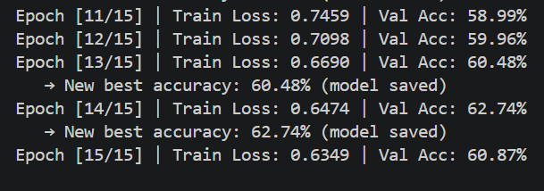

# Skin Disease Classification & Intelligence

> Deep learning-based multi-class skin disease classifier comparing multiple architectures (MobileNet, EfficientNet, and DenseNet) on 22 disease categories, packaged into a Flask web application with Grad-CAM interpretability.

---

## Final Results & Architecture Comparison

Three computer vision architectures were benchmarked. Classifying 22 highly imbalanced skin diseases is a challenging task (random chance baseline is approximately 4.5%).

| Architecture | Validation Accuracy | Characteristics |
|--------------|---------------------|-----------------|
| **DenseNet121** (Final Choice) | **62.23%** | Strong results. Chosen as the final model because its dense feature maps produce sharper, more spatially precise Grad-CAM visualizations for the web app, despite a marginally lower accuracy than MobileNetV2. |
| **MobileNetV2** | **62.74%** | Highest raw validation accuracy of the three, and the fastest to converge. Not selected as the final model, since MobileNet's depthwise separable convolutions produced less spatially precise Grad-CAM explanations than DenseNet. |
| **EfficientNetB2** | Did not converge well | Struggled to reach comparable accuracy on this dataset despite multiple training attempts, including an escalated loss function (see below). |

**Note:** Over 62% accuracy across 22 fine-grained dermatological classes significantly outperforms random guessing. The DenseNet result came from a relatively short training run (25 initial epochs plus 15 fine-tuning epochs), leaving room to extend training further.



---

## Solving Severe Class Imbalance

Real-world medical datasets suffer heavily from class imbalance (e.g., thousands of benign moles, but very few rare vasculitis cases). Left untreated, the model will just predict the majority class. This was addressed through both sampling and loss-function changes:

### 1. Sampling-Level: `WeightedRandomSampler`
Each training sample is assigned a weight inversely proportional to its class frequency. Rarer classes are sampled more often during data loading, so the model sees rare diseases roughly as often as common ones.

### 2. Loss-Level: Weighted `CrossEntropyLoss`
Class weights are passed directly to the loss function. A misclassified minority-class sample contributes proportionally more to the loss, penalizing mistakes on rare diseases more heavily.

This combination (used for DenseNet121 and MobileNetV2) produced the final results above.

### 3. Escalation for EfficientNet-B2: Custom `FocalLoss` + Label Smoothing
Class weighting addresses class *rarity*, but a separate issue appeared independently: some classes are visually confusable regardless of frequency (e.g., Acne vs. Rosacea vs. DrugEruption). To target that, a hand-written Focal Loss was used during EfficientNet-B2's resumed training (`resume_train_b2.py`):

```python
class FocalLoss(nn.Module):
    def forward(self, inputs, targets):
        ce_loss = F.cross_entropy(inputs, targets, weight=self.alpha,
                                   label_smoothing=self.label_smoothing, reduction='none')
        pt = torch.exp(-ce_loss)
        focal_loss = ((1 - pt) ** self.gamma) * ce_loss
        return focal_loss.mean()
```

- **`gamma=2.0`** down-weights the loss contribution from examples the model already classifies confidently, shifting training focus onto hard, ambiguous cases.
- **`alpha=class_weights`** retains the rare-class weighting from above, stacked with the hardness-based reweighting — this loss addresses class imbalance and example difficulty at the same time.
- **`label_smoothing=0.1`** softens the target from a hard 1.0/0.0 split, discouraging overconfidence and improving probability calibration.

Also introduced at this stage: gradient clipping (`clip_grad_norm_`, max norm 1.0) to prevent unstable updates, and a `CosineAnnealingLR` schedule in place of `ReduceLROnPlateau`. Even with this more sophisticated recipe, EfficientNet-B2 still underperformed DenseNet121 and MobileNetV2 — evidence the bottleneck was architectural fit for this dataset size rather than the loss function.

---

## Core Methodologies

### 1. Fine-Tuning & Unfreezing Strategy — staged, discriminative fine-tuning
Rather than training from scratch, ImageNet-pretrained weights are loaded and fine-tuned in stages:

1. **Freeze the entire backbone**, train only the new classifier head (`train_densenet.py` / `train_mobilenet.py`) — higher learning rate (`3e-4`).
2. **Partially unfreeze late blocks only**, at a fixed epoch (epoch 6 for DenseNet: `denseblock4`, `transition3`, `norm5`; epoch 8 for MobileNet: last 5 feature blocks), using a much smaller backbone learning rate (`1e-5`) alongside the classifier's higher rate, via separate optimizer parameter groups.
3. **Fully unfreeze the entire network** in a separate resume pass (`resume_train_densenet.py`) at an even smaller learning rate (`1e-5` across all parameters) for deeper fine-tuning.

This staged approach — new layers learn quickly, pretrained layers shift only slightly — is what pushed DenseNet121's validation accuracy to 62.23%.

### 2. Data Augmentation
Applied via `torchvision.transforms` to expand the effective dataset and reduce memorization:
- Random horizontal and vertical flips (`p=0.5`)
- Rotation (30 degrees in initial training, increased to 45 degrees during the deep fine-tuning resume stage)
- Color jitter (brightness/contrast/saturation) to simulate different lighting conditions and skin tones

### 3. Optimizer & Schedulers
- **Optimizer:** Adam
- **Scheduler:** `ReduceLROnPlateau` (halves the learning rate when validation accuracy plateaus)

---

## The Diagnostic Web App

A Flask web application bridges the backend PyTorch model and the end user.

### Features
1. **Drag-and-drop interface** built with vanilla CSS and JavaScript.
2. **Real-time inference** — forwards the uploaded image to the DenseNet model and returns confidence probabilities.
3. **Grad-CAM integration** — extracts activation gradients from `model.features[-1]` in DenseNet121, highlighting the pixels that most influenced the predicted class.
4. **Risk-tiered messaging** — if a high-risk lesion (e.g., Melanoma, Squamous Cell Carcinoma) is detected, the UI surfaces an alert recommending immediate medical consultation.

---

## How to Run the Project

### 1. Setup Environment
```bash
pip install -r requirements.txt
```

### 2. Start the Web App Server
```bash
python app.py
# Or if using the virtual environment:
venv\Scripts\python app.py
```
The application starts on `http://127.0.0.1:5000`.

### 3. Train Base Models
```bash
python train_densenet.py
# Or for MobileNet
python train_mobilenet.py
```

### 4. Fine-Tune / Resume Training
To unfreeze models further and continue training:
```bash
python resume_train_densenet.py
```

---

## Hardware & Structure
- **Trained on:** NVIDIA RTX 4050 Laptop GPU (6GB VRAM)
- Built with `torch`, `torchvision`, and `pytorch-grad-cam`.

---

## Known Limitations

1. **Evaluation is overall accuracy only.** Given how imbalanced the 22 classes are, per-class recall/precision or a macro-averaged F1 would be a more honest measure of performance than a single accuracy number — a model can score well overall while still failing on rare conditions.
2. **Multiple checkpoint versions exist** (`best_densenet_skin.pth`, `_v2`, `_v3`) from successive fine-tuning passes. The deployed app (`predict.py`, `app.py`) specifically loads `best_densenet_skin_v2.pth` — confirm this is the intended final checkpoint before extending training further.
3. **EfficientNet-B2 remains unresolved.** Multiple escalating attempts (initial training, resumed training, Focal Loss with label smoothing and gradient clipping) all fell short of DenseNet121/MobileNetV2's accuracy — likely an architecture/dataset-size mismatch rather than a training-recipe problem, but not confirmed.
4. **`class_balance_model.py` is a 9-class prototype** from an earlier iteration of the project, before it expanded to the full 22-class dataset — not part of the final pipeline.

*Built for educational and research exploration in applying deep learning to dermatology workflows.*
