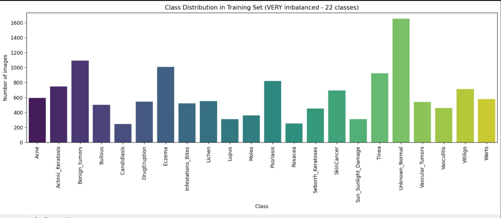

# 🩺 Skin Disease Classification with MobileNetV2

> Deep learning-based multi-class skin disease classifier using transfer learning on 22 disease categories.

---

## 🏆 Final Results

| Metric | Value |
|--------|-------|
| **Best Validation Accuracy** | **62.74%** |
| Architecture | MobileNetV2 (Transfer Learning) |
| Number of Classes | 22 |
| Hardware | NVIDIA RTX 4050 Laptop GPU |

> ⚠️ **Note:** 62.74% accuracy on a 22-class imbalanced dataset is a strong result. Random chance baseline = ~4.5%. The model significantly outperforms random guessing and handles severe class imbalance through weighted sampling and loss techniques.


---

## 📌 Project Overview

This project tackles multi-class skin disease classification using a fine-tuned MobileNetV2 backbone. The dataset consists of **22 skin disease categories** with significant class imbalance — a common real-world challenge in medical imaging.

The pipeline addresses imbalance through both **sampling-level** (WeightedRandomSampler) and **loss-level** (Weighted CrossEntropyLoss) corrections, combined with **gradual fine-tuning** of the pretrained backbone for stable convergence.

**Why MobileNetV2?**
- Lightweight and efficient — well-suited for GPU-constrained environments
- Strong ImageNet pretraining — transfers effectively to dermatology images
- Depthwise separable convolutions reduce overfitting on small medical datasets

---

## ⚙️ Techniques Used

### 1. Transfer Learning with MobileNetV2
A MobileNetV2 backbone pretrained on ImageNet is used as a feature extractor. The classifier head is replaced with a custom fully-connected layer for 22 classes.

### 2. Handling Class Imbalance

**WeightedRandomSampler**
Each training sample is assigned a weight inversely proportional to its class frequency. Rarer classes are sampled more often, preventing the model from ignoring minority classes.

**Weighted CrossEntropyLoss**
Class weights are passed directly to the loss function. Even if a minority class sample is seen, its gradient contribution is amplified — doubly correcting for imbalance.

### 3. Gradual Unfreezing
Instead of fine-tuning the entire backbone at once (which can destroy pretrained features), the **last 8 blocks** of MobileNetV2 are gradually unfrozen during training. Earlier blocks retain low-level ImageNet features; later blocks adapt to skin texture patterns.

### 4. Differential Learning Rates
| Component | Learning Rate |
|-----------|--------------|
| Classifier head | `1e-3` (higher — learning from scratch) |
| Unfrozen backbone blocks | `1e-5` (very low — fine-tuning carefully) |

This prevents catastrophic forgetting while allowing domain adaptation.

### 5. Optimizer & Scheduler
- **Optimizer:** Adam — adaptive learning rates per parameter
- **Scheduler:** `ReduceLROnPlateau` — halves the LR when validation loss plateaus, enabling finer convergence

### 6. Data Augmentation
Applied only to training data to improve generalization:

```python
transforms.RandomHorizontalFlip()
transforms.RandomRotation(degrees=15)
transforms.ColorJitter(brightness=0.2, contrast=0.2, saturation=0.2)
```

These simulate real-world variation in lighting, camera angle, and skin tone rendering.

---

## 📁 Project Structure

```
skin-disease-classification/
│
├── train_mobilenet.py        # Main training script (from scratch)
├── resume_training.py        # Resume from a saved checkpoint
├── best_mobilenet_skin.pth   # Best model weights (saved by val accuracy)
│
├── data/
│   ├── train/                # Training images (organized by class folder)
│   └── val/                  # Validation images (organized by class folder)
│
├── models/
│   └── best_mobilenet_skin.pth
│
├── logs/                     # Training logs (optional)
│
└── README.md
```

> **Expected folder structure for data:**
> ```
> data/train/class_name_1/image1.jpg
> data/train/class_name_2/image2.jpg
> ...
> ```

---

## 🛠️ Installation & Requirements

### Prerequisites
- Python 3.8+
- CUDA-compatible GPU (recommended: 6GB+ VRAM)

### Install Dependencies

```bash
pip install torch torchvision torchaudio --index-url https://download.pytorch.org/whl/cu118
pip install numpy pillow scikit-learn tqdm matplotlib
```

Or install from requirements file:

```bash
pip install -r requirements.txt
```

### requirements.txt

```
torch>=2.0.0
torchvision>=0.15.0
numpy>=1.24.0
pillow>=9.0.0
scikit-learn>=1.2.0
tqdm>=4.65.0
matplotlib>=3.7.0
```

---

## 🚀 How to Train / Resume Training

### Train from Scratch

```bash
python train_mobilenet.py \
  --data_dir ./data \
  --epochs 50 \
  --batch_size 32 \
  --lr 1e-3 \
  --backbone_lr 1e-5 \
  --unfreeze_blocks 8
```

### Resume Training from Checkpoint

```bash
python resume_training.py \
  --checkpoint best_mobilenet_skin.pth \
  --data_dir ./data \
  --epochs 30 \
  --batch_size 32
```

### Key Arguments

| Argument | Default | Description |
|----------|---------|-------------|
| `--data_dir` | `./data` | Path to dataset root |
| `--epochs` | `50` | Total training epochs |
| `--batch_size` | `32` | Batch size |
| `--lr` | `1e-3` | Classifier head learning rate |
| `--backbone_lr` | `1e-5` | Backbone fine-tuning learning rate |
| `--unfreeze_blocks` | `8` | Number of MobileNetV2 blocks to unfreeze |
| `--checkpoint` | `None` | Path to `.pth` file to resume from |

---

## 💡 Training Tips & Best Practices

**Start frozen, then unfreeze gradually**
Train the classifier head for a few epochs first before unfreezing backbone blocks. This prevents early instability.

**Keep backbone LR very low**
`1e-5` or lower for backbone layers. Too high and you'll destroy pretrained ImageNet features within the first epoch.

**Monitor validation accuracy, not just loss**
With class imbalance, training loss can look good while the model ignores minority classes. Track per-class precision/recall alongside overall accuracy.

**Augmentation should match real-world variance**
Avoid aggressive augmentation (e.g., extreme crops, heavy blur) that wouldn't appear in clinical photos.

**Use early stopping**
Save the best checkpoint by validation accuracy, not final epoch. Overfitting is common with small medical datasets.

**Batch size trade-off**
Smaller batches (16–32) work better with WeightedRandomSampler as they increase effective sampling diversity per epoch.

---

## 🔮 Future Improvements

| Improvement | Expected Impact |
|-------------|----------------|
| **EfficientNetV2 / ConvNeXt backbone** | Likely +3–5% accuracy |
| **Mixup / CutMix augmentation** | Better generalization on minority classes |
| **Test-Time Augmentation (TTA)** | +1–2% on validation |
| **Focal Loss** instead of Weighted CE | Better focus on hard examples |
| **Two-stage training** (freeze → gradual unfreeze with LR warmup) | More stable fine-tuning |
| **Larger input resolution** (384×384) | Capture fine skin texture better |
| **Ensemble of 3+ models** | +4–6% accuracy typical for medical imaging |
| **Self-supervised pretraining** on unlabeled skin images | Better domain-specific features |
| **Per-class threshold tuning** | Better recall on rare disease classes |

---

## 🖥️ Hardware & Acknowledgments

### Hardware
- **GPU:** NVIDIA RTX 4050 Laptop GPU (6GB VRAM)
- **Training Time:** ~2–4 hours per 50 epochs depending on dataset size

### Acknowledgments
- [MobileNetV2 Paper](https://arxiv.org/abs/1801.04381) — Sandler et al., 2018
- [PyTorch](https://pytorch.org/) — deep learning framework
- [torchvision](https://pytorch.org/vision/) — pretrained models and transforms
- Dataset sourced from public dermatology benchmarks (ISIC, DermNet, or similar)

---

## 📄 License

This project is for research and educational purposes. If using clinical data, ensure compliance with applicable data privacy regulations (HIPAA, GDPR, etc.).

---

*Built with PyTorch · MobileNetV2 · Transfer Learning · RTX 4050*